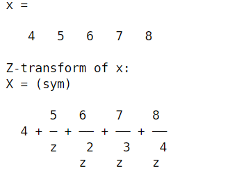
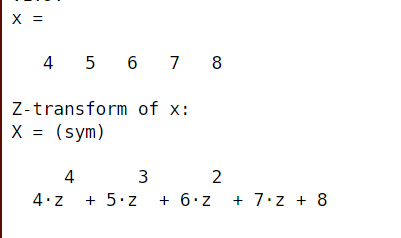
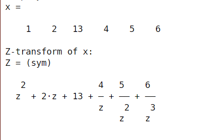

### Experiment No : 05

### Experiment Name : Study of Z-Transformation of Causal, Non-causal and Anti causal Signals


### Theory:

<p style="text-align: justify">

A **causal signal** is one in which changes or variations in the cause (input) lead to corresponding changes in the effect (output), with the effect not occurring before its cause. It represents a cause-and-effect relationship between different elements or events, where the cause precedes the effect in time.
</p>
<p style="text-align: justify">

An **anti-causal signal** is a type of signal where the effect (output) occurs before its cause (input). This implies a reversal of the cause-and-effect relationship, which is contrary to the usual understanding of how events unfold over time.
</p>
<p style="text-align: justify">

A **non-causal signal** is a signal where there is no clear cause-and-effect relationship between the input and output. In other words, changes in the input do not necessarily result in predictable changes in the output, and the timing of cause and effect might not be well-defined.
</p>

## Code:
**Causal signal:**
```matlab
x = [4 5 6 7 8];
l = length(x);
X = 0;
z = sym('z');
for i = 0:l-1
    X = X + x(i+1)*z^(-i);
end
display(x)
disp('Z-transform of x:')
display(X)
```
**Non-causal**
```matlab
x = [4 5 6 7 8];
l = length(x);
X = 0;
z = sym('z');
for i = l-1:-1:0
    X = X + x(i+1)*z^(abs(i-(l-1)));
end
display(x)
disp('Z-transform of x:')
display(X)
```
**Anti-causal**
```matlab
x = [4 5 6 7 8];
z_val = 3; %index 3 = value 13
l = length(x);
Z = 0;
z = sym('z');
for i = z_val:-1:1
    Z = Z + x(i)*z^(abs(i-(z_val)));
end
for j = z_val+1:l
    Z = Z + x(j)*z^(-(j-z_val));
end
display(x)
disp('Z-transform of x:')
display(Z)
```
## Output:

**Causal signal:**



**Non signal:**



**Anti-causal**


